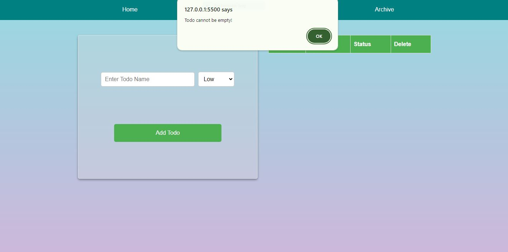
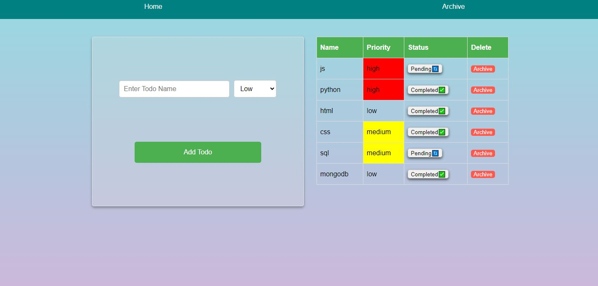
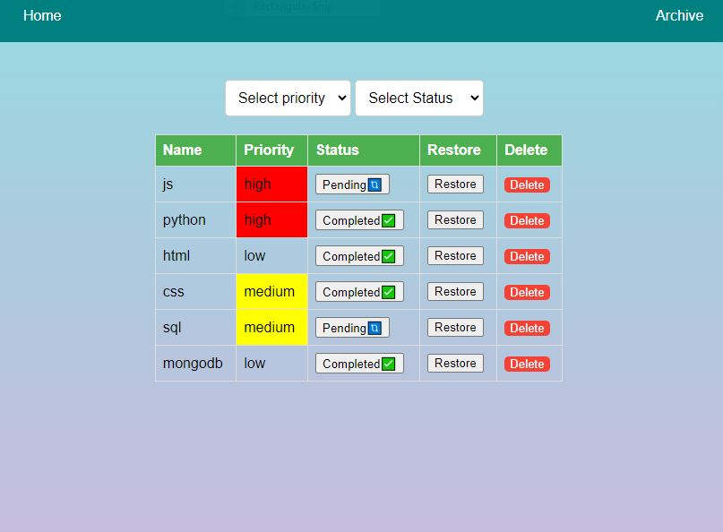
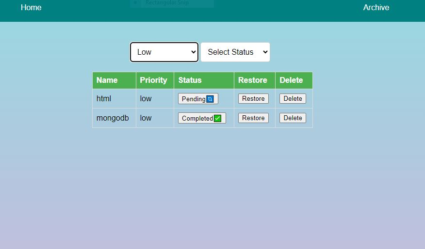
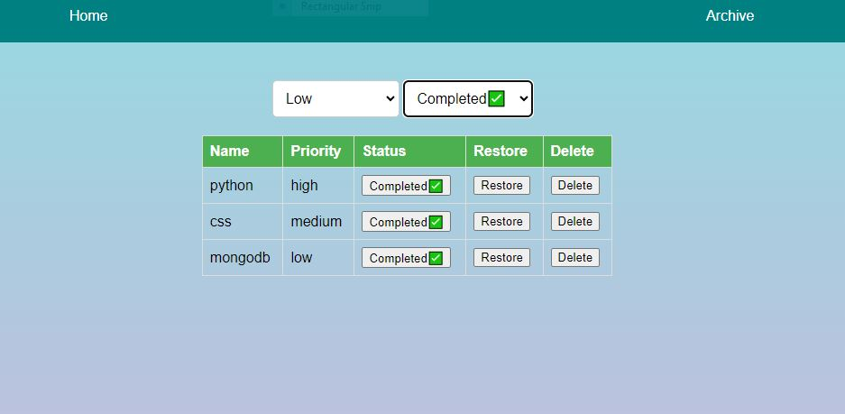

# Todo App
## Description
This is a simple and interactive Todo app built using HTML, CSS, and JavaScript. It helps users manage their tasks by allowing them to add, mark as complete, and delete tasks.

## Features
* Add new tasks
* Mark tasks as complete
* Delete tasks
* Responsive design for various screen sizes
  
## Technologies Used
**HTML:** Structure of the app  
**CSS:** Styling of the app  
**JavaScript:** Functionality of the app

## Screenshots
If todo is empty  

When task added  

When task added to archive view  

Filter By Priority Low  

Filter by completed status  

## Contact
Name: Pradip Kumar Madheshiya  
Email: prdpmadheshiya@gmail.com
